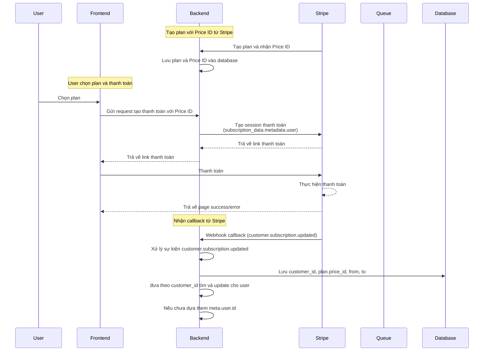

```mermaid
sequenceDiagram
    participant User
    participant Frontend
    participant Backend
    participant Stripe
    participant Queue

    Note over Backend: Tạo plan với Price ID từ Stripe
    Stripe->>Backend: Tạo plan và nhận Price ID
    Backend->>Backend: Lưu plan và Price ID vào database

    Note over Frontend: User chọn plan và thanh toán
    User->>Frontend: Chọn plan
    Frontend->>Backend: Gửi request tạo thanh toán với Price ID

    Backend->>Stripe: Tạo session thanh toán <br> (subscription_data.metadata.user)
    Stripe-->>Backend: Trả về link thanh toán
    Backend-->>Frontend: Trả về link thanh toán

    Frontend->>Stripe: Thanh toán
    Stripe -->> Stripe: Thực hiện thanh toán
    Stripe-->>Frontend: Trả về page success/error

    Note over Backend: Nhận callback từ Stripe
    
    Stripe->>Backend: Webhook callback (customer.subscription.updated)
    Backend->>Backend: Xử lý sự kiện customer.subscription.updated
    Backend->>Database: Lưu customer_id, plan.price_id, from, to
    Backend->>Backend: đưa theo customer_id tìm và update cho user
    Backend->>Backend: Nếu chưa dựa them meta.user.id
```
